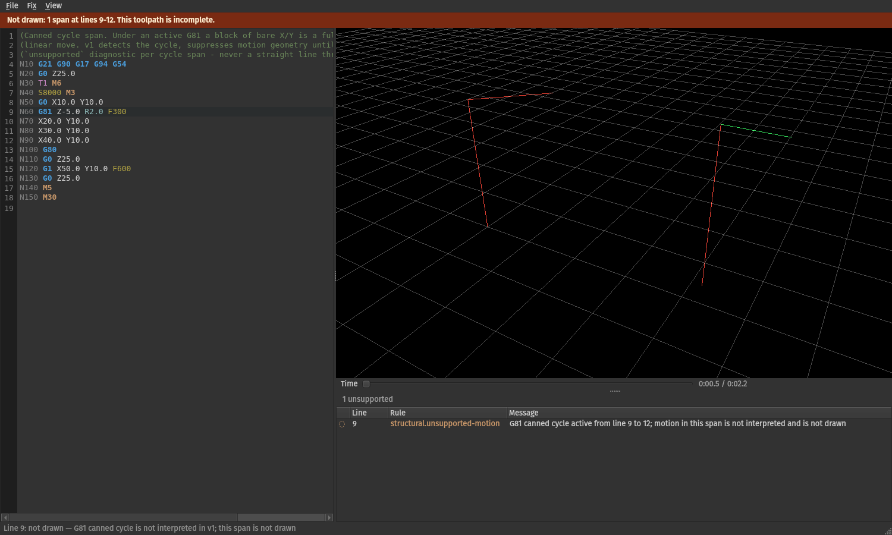
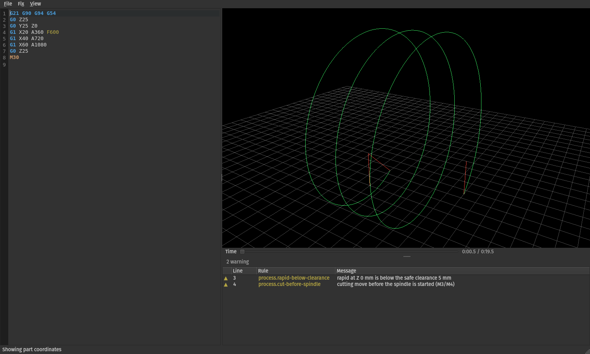
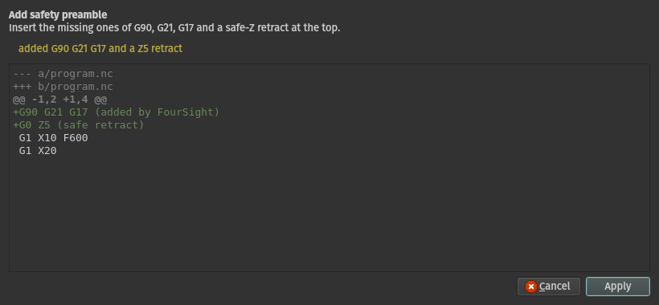

# FourSight

A 4-axis G-code previewer and verifier. It draws the toolpath, checks the program against a machine
profile, and offers fixes — with one governing rule:

> **Never render a confidently wrong toolpath.** A previewer that refuses to draw is recoverable; one that
> draws the wrong path is worse than no previewer.



That screenshot is the rule in action. The program contains a `G81` drill cycle, which FourSight does not
interpret — so the span is **not drawn at all**, there is a gap in the toolpath where the holes would be,
a banner says the picture is incomplete, and the diagnostics panel reports it as `unsupported` rather than
as a warning. The alternative — a straight line through the hole positions — would have looked entirely
plausible and been wrong.

## Why 4-axis matters

In machine coordinates, wrapping a feature around a cylinder is three straight lines. In part coordinates
it is what the tool actually cuts:



Simultaneous XYZ+A moves are transformed **per interpolation step**, not from their endpoints — endpoint-only
transformation collapses a helix into a straight chord, and it is the single most likely source of silently
wrong output. Measured: a four-turn wrap lands on its cylinder to within 3.55e-15 mm.

## Install

```bash
python3.12 -m venv .venv
.venv/bin/pip install -e ".[gui]"        # viewer; omit [gui] for the CLI only
```

Python 3.11+ (`tomllib` is stdlib from 3.11).

## Use

```bash
foursight-gui part.nc                    # open the viewer
foursight check part.nc                  # verify, exit 1 if errors were found
foursight parse part.nc                  # dump the parsed blocks
```

`foursight check` is built for a pipeline: diagnostics go to stdout in compiler format
(`file:line: severity [rule] message`), tool problems go to stderr, and the exit code is **0** clean,
**1** errors found, **2** could not run. `unsupported` and `warning` do not fail a run — failing on
`unsupported` would push users toward suppressing the check entirely, which is worse than reporting a span
that was not interpreted.

The CLI needs no Qt. That is enforced by a CI job that installs without the `[gui]` extra.

## Three tiers, and why they are not degrees of the same thing

| Tier | Means | What the viewer does |
|---|---|---|
| `error` | Malformed, or would break the machine | Reported; geometry drawn where it can be |
| `unsupported` | Well-formed, recognized, **affects motion**, not interpreted in v1 | The span is **not drawn**, or drawn and explicitly marked — never drawn as if understood |
| `warning` | Suspicious, or unrecognized but inert | Drawn normally |

An unrecognized code that never touches position is a warning. One that changes how later motion is
interpreted is `unsupported`. Under an active `G81`, a block containing only `X10 Y10` is a drill cycle,
not a linear move — and that difference is the whole reason the middle tier exists.

## Fixes refuse when the intent is ambiguous



Every fix is previewed as a unified diff and applied only on confirmation, to the **editor buffer** — the
file on disk is never written until you save. Applying one fix re-runs the entire pipeline (parse →
simulate → verify), because a fix shifts every line number after it and a second fix aimed at "line 42"
would otherwise land somewhere else.

Two fixes decline on purpose:

- **Arc-centre recomputation** refuses beyond 10× tolerance. Within a small mismatch the centre is a
  rounding artefact and the endpoints are the intent; past that, three inconsistent numbers describe no arc
  and choosing which to keep is a guess.
- **IJK→R conversion** refuses on a full circle. R gives a radius and its sign picks the minor or major arc,
  but coincident endpoints make every R the same degenerate case.

N-word stripping is available but marked destructive and never the default: operators restart mid-cut on
N-numbers and some dialects use them as jump targets, so removing them can break a program in ways **the
diff does not show**.

## Machine profiles

A TOML file describes the machine — travel limits, rapid rates, tolerances, rotary mount and centreline.
The rule throughout is that **absence means unknown, never a fabricated value**: a limit that is not
configured disables its check rather than defaulting to something plausible, and a head-mount profile with
no `pivot_to_tip` refuses to show part coordinates rather than inventing a tool length.

```bash
foursight check part.nc --profile my-mill.toml
```

See `src/foursight/profiles/default_4axis.toml`, which documents every field inline.

## Performance

Measured on an Intel Iris Xe / Mesa 25.1.5 baseline:

| | |
|---|---|
| Parse | 96k lines/sec |
| 100k-line file to first frame | 4.5 s |
| Orbit, 500k segments | 241 fps (worst frame 10.7 ms) |
| Geometry + GL buffers, 500k segments | 50.5 MB |
| Click → segment, 500k segments | 27 ms |

Loading runs off the GUI thread and is cancellable; a cancelled load leaves the previous toolpath on
screen rather than a partial one, because half a program is not a program.

## Dialect

LinuxCNC is normative. Documented deviations from Fanuc are listed in `PLAN.md` § Dialect Divergences —
`G4 P` in seconds rather than milliseconds, `%`/`Oxxxx` framing consumed silently, `;` comments accepted.
Block delete (`/`) executes by default, matching the common control-panel default, with a toggle.

## Development

```bash
.venv/bin/pip install -e ".[dev,gui]"
.venv/bin/pytest -q                                        # 1150+ tests
.venv/bin/ruff check --fix . && .venv/bin/ruff format .
.venv/bin/python scripts/build.py                          # PyInstaller one-dir bundle
```

`PLAN.md` is the design record and owns every architectural decision, with the reasoning for each.
`TASKS.md` is the execution log. When the two disagree, PLAN.md wins.

Testing leans on three things beyond ordinary unit tests: **mutation testing** (a test that passes when the
code is broken is not a test), **golden fingerprints** of simulator output that name the field that moved
rather than only that a hash changed, and **closed-form geometry checks** for kinematics — compared against
independently computed expectations rather than recorded output, because a golden will happily lock in a
mirrored wrap.

## Status

M0–M5 complete. Known gaps, all deliberate and recorded in `PLAN.md`:

- **No tool table**, so `G43`/`G44` tool length is not modelled. The path's shape is correct and its Z datum
  is shifted; the program is drawn and flagged `unsupported`, because refusing every program that uses G43
  would make the previewer useless.
- **No stock model**, so rotary step sizing uses the path's radius as a proxy for the part's.
- **No cutter-compensation geometry.** The programmed centreline is drawn and marked unverified.
- Windows bundles are built in CI but have not been launched on a clean Windows VM.
